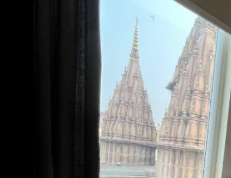
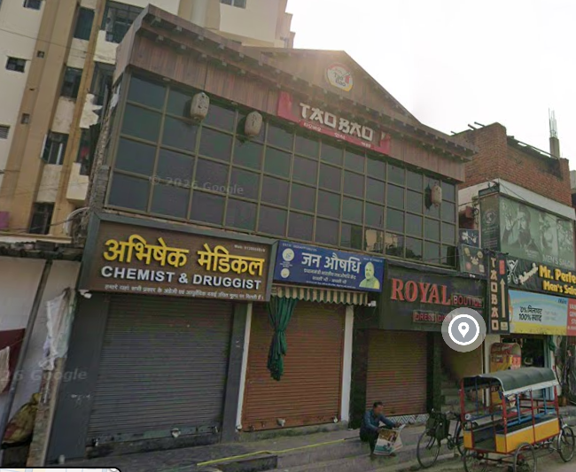
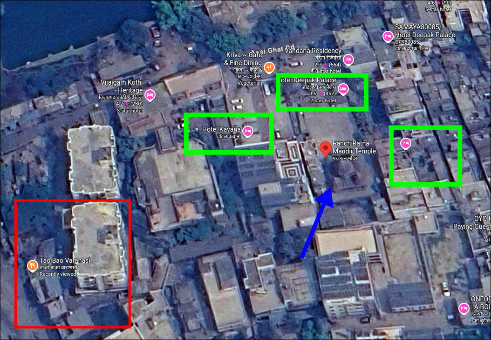
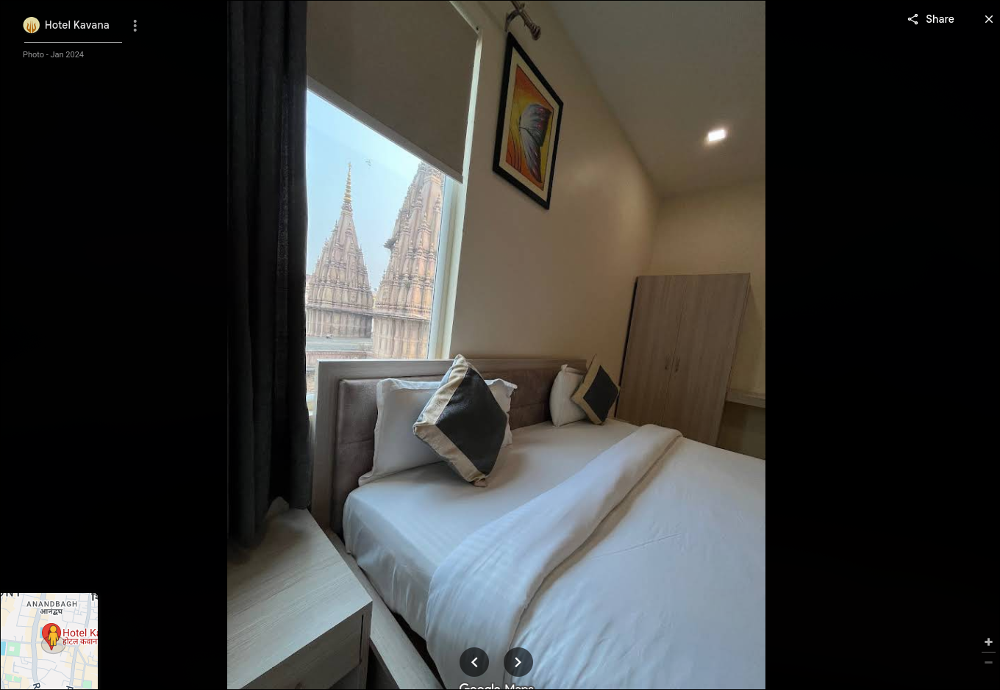

## Description
#### I love roaming around and so i did a lot in my vacations, although i clicked many photos but due to privacy concerns i am only sharing a few with you all. Hope you won't give me trouble

> **Flag Format:** `kashiCTF{HOTEL_NAME_IN_CAPS}`

>This challenge consisted of two files. One was a photograph of a temple taken from a hotel, and the other was an image showing a restaurant along with several nearby shops. 

> I just searched the second image on google reverse image search and i got the place.
> It was **Tao Bao Varanasi**. I used google maps to find temples nearby it.

> I found a Temple called **Panch Ratna Mandir Temple** near that restaurant.
> There was 3 Hotels nearby it.
> After that i just looked the images of Hotel Kavana. I saw the same image in the gallery !

 
> Final Flag: **kashiCTF{HOTEL_KAVANA}**